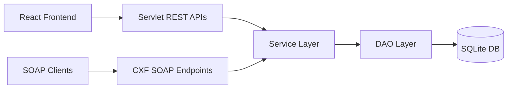

# Cafe PearlJam Backend Guide

## Project Overview
This backend is a Java WAR application for Cafe PearlJam that serves:
- REST APIs for the React frontend under `/api/*`
- SOAP APIs (WSDL-enabled) under `/ws/*`
- SQLite-backed persistence for users, restaurants, menus, orders, delivery zones, and coupons

The runtime is embedded Tomcat through Maven Cargo, with CXF providing SOAP services.

## Tech Stack
- Java 23: core language/runtime
- Jakarta Servlet API: REST servlet layer
- Apache CXF JAX-WS: SOAP service publication and WSDL generation
- Jackson: JSON serialization/deserialization
- SQLite JDBC: persistent local database
- Maven: build/test/package lifecycle
- Cargo Maven Plugin: embedded Tomcat run
- JUnit 5: test framework (currently no test classes were present)

## Directory and Package Structure
- `src/main/java/com/foodapp/api`: HTTP/SOAP API surface
  - `servlet`: REST endpoints
  - `soap`: SOAP contracts and implementations
  - `soap/dto`: SOAP request/response DTOs
- `src/main/java/com/foodapp/config`: app bootstrap/constants/config
- `src/main/java/com/foodapp/dao`: SQL data access
- `src/main/java/com/foodapp/model`: domain models/enums
- `src/main/java/com/foodapp/service`: business logic
- `src/main/java/com/foodapp/util`: infrastructure utilities
- `src/main/resources`: `schema.sql`, `sample-data.sql`, `app.properties`
- `src/main/webapp/WEB-INF/web.xml`: servlet/filter mappings

## Source File Responsibilities

### API layer
- `api/ApiResponse.java`: standard response envelope `{status,data,message}`.
- `api/filter/CorsFilter.java`: CORS headers for `/api/*`.
- `api/servlet/BaseServlet.java`: shared JSON and request-body handling.
- `api/servlet/UserServlet.java`: user registration/login endpoints.
- `api/servlet/RestaurantServlet.java`: list/search/sort restaurants, details, restaurant menu, registration.
- `api/servlet/MenuServlet.java`: menu category/item create, stock/availability updates.
- `api/servlet/OrderServlet.java`: place order, order details, order status, status update, simulated payment/rider assignment.
- `api/soap/SoapServlet.java`: CXF servlet extension that publishes SOAP endpoints on the CXF bus.
- `api/soap/*.java`: SOAP contracts and implementations for users, restaurants, menu, and orders.
- `api/soap/dto/*.java`: JAXB DTOs used in SOAP message payloads.

### Config/bootstrap
- `config/AppConstants.java`: shared constants and servlet-context keys.
- `config/DatabaseConfig.java`: properties reader for DB/pool/sample-data flags.
- `config/AppInitializer.java`: app startup sequence (pool, schema, DAOs, services, servlet-context wiring).
- `config/CorsFilter.java`: global CORS fallback filter.

### Data access
- `dao/UserDAO.java`: users CRUD-related queries (lookup/password/active).
- `dao/RestaurantDAO.java`: restaurant create/read/update/schedule/owner queries.
- `dao/MenuCategoryDAO.java`: category CRUD.
- `dao/MenuItemDAO.java`: item CRUD, stock and availability updates.
- `dao/MenuItemAddonDAO.java`: add-on CRUD and availability.
- `dao/DeliveryZoneDAO.java`: delivery zone CRUD/lookups.
- `dao/OrderDAO.java`: order create/read/status/payment updates.
- `dao/OrderItemDAO.java`: batch persist and fetch order items.
- `dao/CouponDAO.java`: coupon lookup and usage increment.

### Services
- `service/UserService.java`: registration, login, password change.
- `service/RestaurantService.java`: restaurant registration/list/search/schedule.
- `service/MenuService.java`: category/item/add-on workflows and menu retrieval.
- `service/DeliveryZoneService.java`: zone management.
- `service/CouponService.java`: coupon validation and discount application.
- `service/OrderService.java`: order placement pipeline (validation, stock, addons, delivery fee, coupon, payment state) and status workflows.

### Models
- `model/User.java`, `UserRole.java`
- `model/Restaurant.java`
- `model/MenuCategory.java`, `MenuItem.java`, `MenuItemAddon.java`
- `model/DeliveryZone.java`
- `model/Order.java`, `OrderItem.java`, `OrderStatus.java`, `PaymentStatus.java`
- `model/Coupon.java`

### Utilities
- `util/DatabaseConnectionPool.java`: simple synchronized SQLite connection pool.
- `util/SchemaInitializer.java`: schema/sample-data bootstrap.
- `util/JsonMapper.java`: singleton Jackson mapper.
- `util/PasswordHasher.java`: salted SHA-256 hashing/verification.
- `util/TimeUtil.java`: ISO timestamp/time-window utilities.
- `util/UUIDGenerator.java`: UUID helper.
- `util/Validator.java`: basic validation helpers.

## Database Schema (SQLite)
- `users(id, name, email, password_hash, phone, role, created_at, is_active)`
- `restaurants(id, owner_id, name, description, address, area, latitude, longitude, phone, cuisine_type, is_active, opens_at, closes_at, created_at)`
- `menu_categories(id, restaurant_id, name, display_order)`
- `menu_items(id, category_id, restaurant_id, name, description, base_price, image_url, is_available, track_quantity, quantity_in_stock, preparation_time_minutes, created_at)`
- `menu_item_addons(id, menu_item_id, name, extra_price, is_available)`
- `coupons(id, code, description, discount_type, discount_value, minimum_order_value, max_uses, current_uses, expires_at, is_active)`
- `orders(id, customer_id, restaurant_id, delivery_address, delivery_area, subtotal, delivery_fee, discount_amount, total, status, payment_status, payment_method, special_instructions, placed_at, confirmed_at, delivered_at)`
- `order_items(id, order_id, menu_item_id, item_name, item_price, quantity, selected_addons, item_total)`
- `delivery_zones(id, restaurant_id, area_name, delivery_fee, estimated_minutes)`

Relationships:
- `restaurants.owner_id -> users.id`
- menu categories/items/addons chained to restaurant/menu hierarchy
- orders linked to customer and restaurant
- order items linked to orders and menu items
- delivery zones linked to restaurants

## REST API Reference
All responses are wrapped as:
```json
{ "status": "success|error", "data": ..., "message": "..." }
```

- `GET /api/restaurants?area=&query=&sort=name|cuisine`
- `GET /api/restaurants/{id}`
- `GET /api/restaurants/{id}/menu`
- `POST /api/restaurants/register`
- `POST /api/users/register`
- `POST /api/users/login`
- `POST /api/menu/categories`
- `POST /api/menu/items`
- `PATCH /api/menu/items/{id}/availability`
- `PATCH /api/menu/items/{id}/stock`
- `POST /api/orders`
- `GET /api/orders/{id}`
- `GET /api/orders/{id}/status`
- `GET /api/orders/customer/{customerId}`
- `PATCH /api/orders/{id}/status`
- `PATCH /api/orders/{id}/payment` (simulated success)
- `PATCH /api/orders/{id}/assign-rider` (simulated assignment)

Example place-order body:
```json
{
  "customerId": "u-123",
  "restaurantId": "r-123",
  "deliveryAddress": "House 1",
  "deliveryArea": "Gulshan",
  "couponCode": "FIRST50",
  "paymentMethod": "CARD",
  "specialInstructions": "",
  "items": [
    { "menuItemId": "mi-123", "quantity": 1, "addonIds": [] }
  ]
}
```

## SOAP / WSDL Reference
- Service index: `GET /foodapp/ws`
- WSDLs:
  - `/foodapp/ws/users?wsdl`
  - `/foodapp/ws/restaurants?wsdl`
  - `/foodapp/ws/menu?wsdl`
  - `/foodapp/ws/orders?wsdl`

Core operations:
- Restaurant: `getRestaurantsByArea`, `searchRestaurants`, `getRestaurantDetails`, `getDeliveryZones`
- Menu: `getMenu`, `searchMenuItems`, `getItemAddons`
- Order: `placeOrder`, `getOrderStatus`, `getOrdersByCustomer`, `cancelOrder`

Example SOAP request (`getOrderStatus`):
```xml
<soapenv:Envelope xmlns:soapenv="http://schemas.xmlsoap.org/soap/envelope/" xmlns:ws="http://foodapp.com/ws">
  <soapenv:Header/>
  <soapenv:Body>
    <ws:getOrderStatus>
      <orderId>abb1f1fc-7724-4d99-ab9d-5f1f833c2eb2</orderId>
    </ws:getOrderStatus>
  </soapenv:Body>
</soapenv:Envelope>
```

## Build, Run, and Test
From `PearlJam_Backend`:
- Build + tests: `mvn clean test`
- Package WAR: `mvn package`
- Run embedded server: `mvn package cargo:run`

Server base URL:
- `http://localhost:8080/foodapp`

## Configuration (`app.properties`)
- `db.path`: SQLite DB file path (relative or absolute)
- `db.pool.min`: initial pooled connections
- `db.pool.max`: max pooled connections
- `db.pool.timeout`: wait timeout (ms) for a free connection
- `app.load.sample.data`: load `sample-data.sql` when schema is first created

## Validation Done
- Build/test command succeeded: `mvn clean test`
- Server startup verified on Tomcat 10 embedded via Cargo
- REST verified:
  - `GET /api/restaurants`
  - `GET /api/restaurants/{id}/menu`
  - `POST /api/orders`
  - `GET /api/orders/{id}/status`
  - Restaurant-side status update: `PATCH /api/orders/{id}/status`
- SOAP verified via raw XML POST to:
  - `/ws/restaurants` (`getRestaurantsByArea`)
  - `/ws/menu` (`getMenu`)
  - `/ws/orders` (`getOrderStatus`)
  and each returned populated XML responses.

## Mermaid Diagram


## Known Limitations / Next Improvements
- No automated JUnit coverage exists yet for service and servlet behaviors.
- Authentication/authorization is minimal and should be hardened before production.
- Simulated payment and rider assignment are structural placeholders and should be replaced by real integrations.
- Legacy `config/CorsFilter` and `api/filter/CorsFilter` overlap; can be consolidated later.
