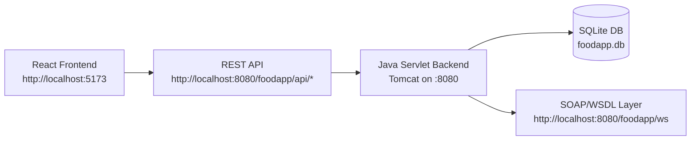
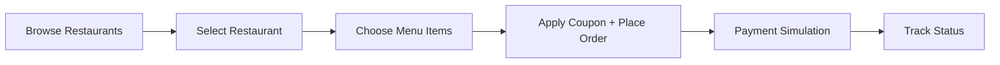
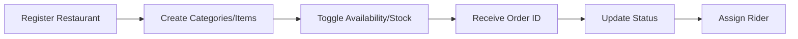
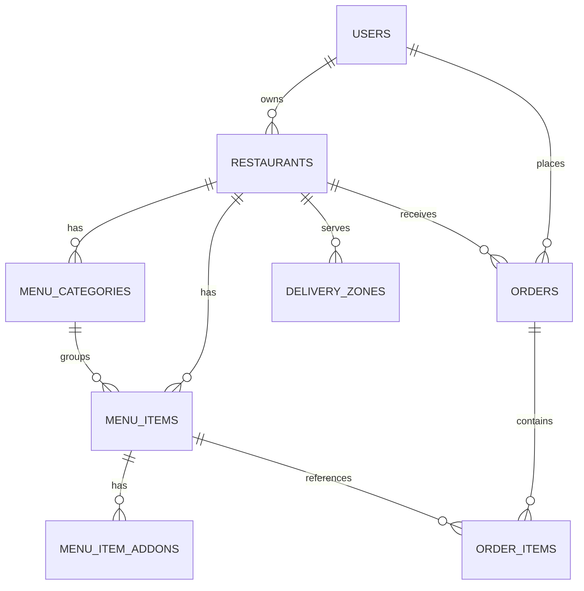

# Cafe PearlJam

Cafe PearlJam is a food delivery system with a React frontend and a Java backend. Users can browse restaurants, place and track orders, and restaurant owners can manage menus and order status. The backend exposes both REST APIs for the frontend and SOAP/WSDL services per project requirements.

## System Architecture



## Tech Stack

| Layer | Technology | Purpose |
|---|---|---|
| Frontend | React + Vite + Tailwind | UI and client routing |
| Frontend State | TanStack Query + Zustand | Server state + cart state |
| Frontend HTTP | Axios | REST calls + envelope handling |
| Backend | Java Servlet + CXF + Maven Cargo | REST + SOAP runtime |
| Database | SQLite | Persistent relational storage |
| Protocols | REST/JSON + SOAP/WSDL | Client/backend integrations |

## Repository Structure

```text
IUT_CafePearlJam/
├─ PearlJam_Backend/         # Java backend (REST + SOAP, DB, schema)
├─ PearlJam_Frontend/        # React frontend app
├─ project_requirements.txt  # Original project requirements
└─ README.md                 # Master system guide
```

## How This Matches Requirements
- Supports user-side flow: browse/search/sort restaurants, menu selection, order placement, coupon in payload, order tracking, payment simulation.
- Supports restaurant-side flow: registration, menu category/item create, availability + stock management, order status updates, rider assignment.
- Exposes SOAP/WSDL endpoints as required at `/foodapp/ws/*`.
- Follows modular package/component design and documented structure.

## Run Full System

### Prerequisites
- Java 23+
- Maven 3.9+
- Node.js 18+ (or newer LTS)
- npm 9+

### 1) Clone
```bash
git clone <your-repo-url>
cd IUT_CafePearlJam
```

### 2) Start Backend
```bash
cd PearlJam_Backend
mvn package cargo:run
```

### 3) Start Frontend
```bash
cd ../PearlJam_Frontend
npm install
npm run dev
```

### 4) Verify Running URLs
- Frontend: `http://localhost:5173`
- Backend base: `http://localhost:8080/foodapp`
- REST sample: `http://localhost:8080/foodapp/api/restaurants`
- SOAP service index: `http://localhost:8080/foodapp/ws`
- WSDLs:
  - `http://localhost:8080/foodapp/ws/users?wsdl`
  - `http://localhost:8080/foodapp/ws/restaurants?wsdl`
  - `http://localhost:8080/foodapp/ws/menu?wsdl`
  - `http://localhost:8080/foodapp/ws/orders?wsdl`

## REST API Quick Reference

| Method | Path | Purpose |
|---|---|---|
| GET | `/api/restaurants` | List/search/sort restaurants |
| GET | `/api/restaurants/{id}/menu` | Get restaurant menu |
| POST | `/api/orders` | Place order (supports coupon code) |
| GET | `/api/orders/{id}/status` | Track order status |
| PATCH | `/api/orders/{id}/status` | Update order status |
| PATCH | `/api/orders/{id}/payment` | Simulated payment processing |
| PATCH | `/api/orders/{id}/assign-rider` | Assign rider (simulated) |

## SOAP/WSDL Quick Reference

| WSDL Endpoint | Service | Operations |
|---|---|---|
| `/ws/users?wsdl` | UserService | registerUser, login |
| `/ws/restaurants?wsdl` | RestaurantQueryService | getRestaurantsByArea, searchRestaurants, getRestaurantDetails, getDeliveryZones |
| `/ws/menu?wsdl` | MenuQueryService | getMenu, searchMenuItems, getItemAddons |
| `/ws/orders?wsdl` | OrderService | placeOrder, getOrderStatus, getOrdersByCustomer, cancelOrder |

## User Flow



## Restaurant Owner Flow



## Database Schema



## GitHub
- [github.com/safwansatil](https://github.com/safwansatil)