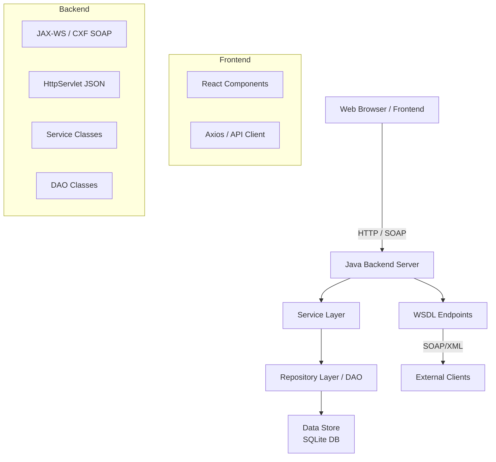
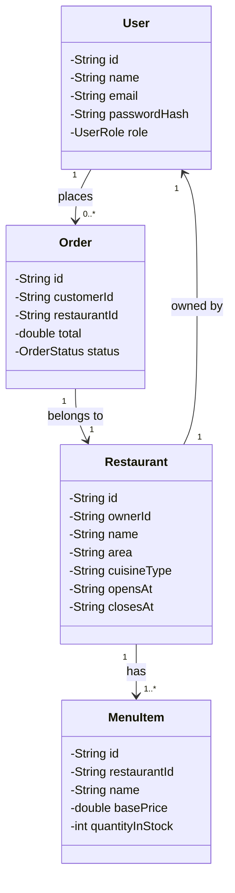
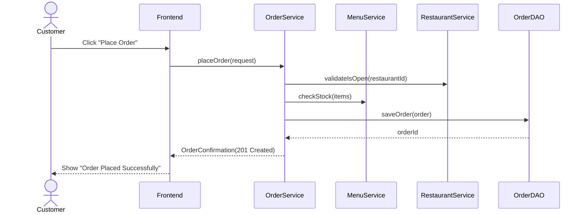
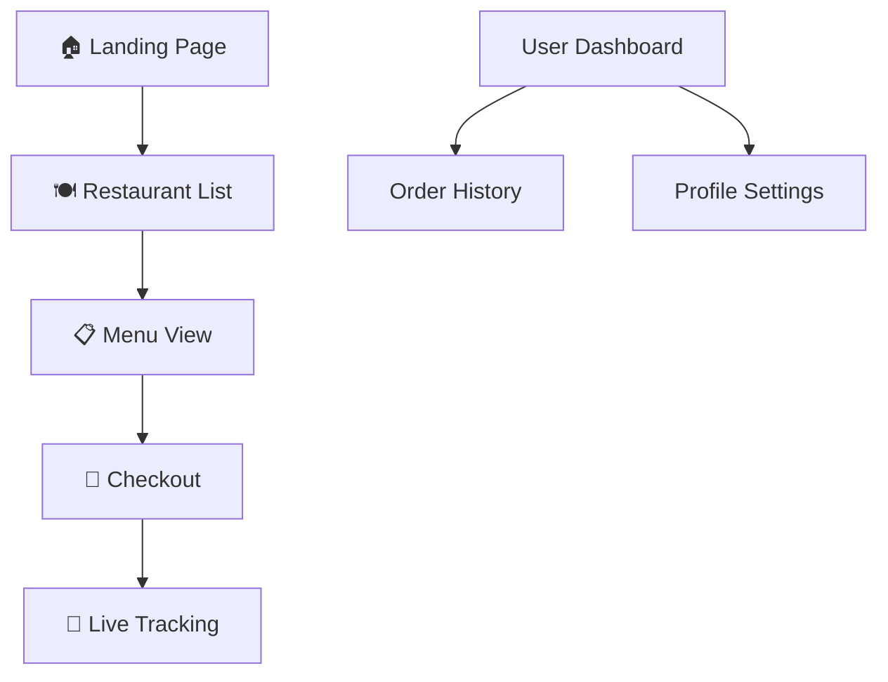
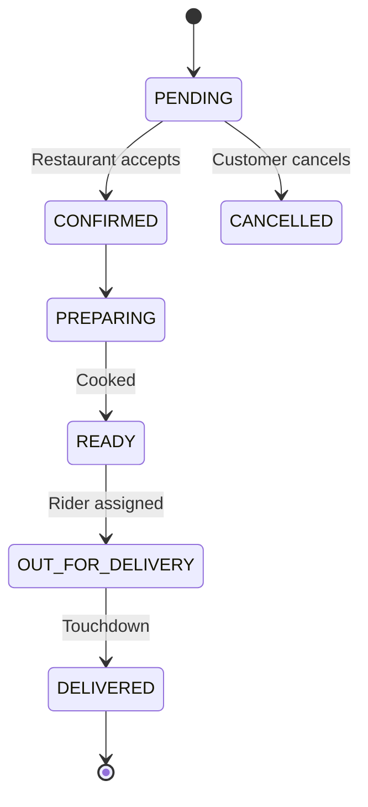

# 📘 PearlJam — Technical Documentation

═══════════════════════════════════════════════════════
SECTION 1: INTRODUCTION & SYSTEM OVERVIEW
═══════════════════════════════════════════════════════

## 1.1 System Purpose & Scope
PearlJam is a comprehensive food delivery management system designed for a two-sided marketplace (Customers and Restaurant Owners). It facilitates restaurant discovery, menu management, order placement, and live status tracking.

## 1.2 High-Level Architecture
The system follows a classic N-tier architecture, emphasizing a strict separation of concerns. It is built as a monolithic Java backend that exposes dual interfaces (SOAP for formal service contracts and JSON for web frontend consumption) interacting with a decoupled React-based frontend.

## 1.3 Key Technical Decisions
- **JAX-WS over REST:** Chosen to meet the course requirements for formal WSDL-based web services.
- **SQLite:** Used for persistence to provide an "out-of-the-box" experience without requiring a heavy database server setup.
- **No-Framework Backend (No Spring):** The project uses vanilla Jakarta EE 10 servlets and CDI-style dependency injection handled manually during startup to demonstrate core Java mastery.

═══════════════════════════════════════════════════════
SECTION 2: BACKEND ARCHITECTURE
═══════════════════════════════════════════════════════

## 2.1 Package Structure & Design Philosophy
The backend follows the **One-Class-Per-Functionality** principle. Each class has a single responsibility, avoiding "God classes."

- `com.foodapp.api`: Contains SOAP and Servlet entry points.
- `com.foodapp.service`: Pure business logic (e.g., pricing calculations, validation).
- `com.foodapp.dao`: JDBC implementations (SQL logic).
- `com.foodapp.model`: Simple POJO entities.
- `com.foodapp.util`: Shared infrastructure (Connection Pool, Hashers).

## 2.2 Domain Model (Entity Classes)

## 2.3 Service Layer & Order Placement Flow
Services are stateless and thread-safe. They encapsulate all business rules.

## 2.4 Data Access Layer
Data is stored in `data/foodapp.db`. The **DAO Layer** uses a manual `DatabaseConnectionPool` (utilizing `synchronized` blocks) to manage threads. All SQL queries are parameterized `PreparedStatements`.

═══════════════════════════════════════════════════════
SECTION 3: FRONTEND ARCHITECTURE
═══════════════════════════════════════════════════════

## 3.1 Overview
The frontend is a modern SPA built with **React 18** and **Vite**. 

- **Styling:** Tailwind CSS + Radix UI.
- **Design System:** Editorial Organicism (Stitch Design compliance).
- **State Management:** Zustand (for lightweight global state like cart).

## 3.2 Navigation Flow

═══════════════════════════════════════════════════════
SECTION 4: DATA FLOW & BUSINESS LOGIC
═══════════════════════════════════════════════════════

## 4.1 Order Lifecycle

## 4.2 Availability Logic
The `RestaurantService` parses `opensAt` and `closesAt` (ISO-8601 strings) and compares them against the current system time using `TimeUtil.isCurrentlyOpen`. Restaurants outside their window are marked as `CLOSED` and ordering is disabled.

═══════════════════════════════════════════════════════
SECTION 5: BUILD & CONFIGURATION
═══════════════════════════════════════════════════════

- **Backend Build:** `mvn clean package`
- **Backend Start:** `mvn tomcat10:run`
- **Frontend Build:** `npm run build`
- **Database Path:** Configured in `src/main/resources/app.properties`.

---

*For detailed audit reports, see [QA_SUMMARY.md](./QA_SUMMARY.md) and [STITCH_REPORT.md](./STITCH_REPORT.md).*
