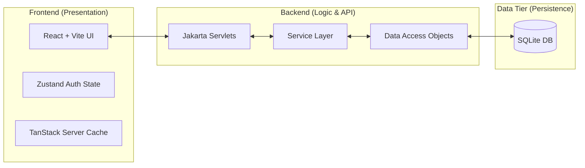

# PearlJam Food Delivery System: Technical Guide & Project Overview

Welcome to the technical documentation for **PearlJam**, a comprehensive food delivery and cafe management system. This document is designed to provide a deep architectural overview, technical justifications, and a "viva-ready" preparation guide for presenting this project to a technical supervisor.

---

## 1. Executive Summary
PearlJam is a full-stack web application designed to streamline food ordering and restaurant management specifically tailored for controlled environments like a university campus or a private cafe network.

- **Primary Goal**: Provide a seamless interface for customers to browse menus, place orders, and track deliveries, while giving restaurant owners a powerful dashboard to manage inventory and fulfillment.
- **Core Value Proposition**: A lightweight, high-performance architecture that prioritizes portability (via SQLite) and modern user experience (via React/Vite).

---

## 2. System Architecture
The project follows a **Decoupled N-Tier Architecture**, separating the presentation, business logic, and data access layers into two distinct repositories.

### High-Level Flow


### Architectural Rationale
- **Separation of Concerns**: By keeping the Frontend and Backend separate, the system can scale independently. The frontend could be swapped for a mobile app without touching a single line of backend logic.
- **Jakarta EE Compliance**: The backend relies on standard Jakarta Servlets and Maven, ensuring it follows enterprise Java best practices.
- **Single-Source-of-Truth**: The `Service Layer` acts as the orchestrator, ensuring that business rules (like checking inventory before an order) are never bypassed.

---

## 3. Backend Deep-Dive: Java & Jakarta EE

### 3.1 Persistence & Concurrency Management
While many academic projects use simple JDBC connections, PearlJam implements a custom **`DatabaseConnectionPool`** to handle the unique nature of SQLite.

- **SQLite Constraint**: SQLite is excellent for portability but only allows one writer at a time.
- **The Solution**: Our thread-safe connection pool manages a set of connections. It uses `synchronized` blocks and `wait/notify` mechanisms to ensure that multiple API requests from the frontend don't crash the database with "busy" or "locked" errors.
- **Schema Initialization**: The system uses `SchemaInitializer` to automatically detect if the database exists and build the tables from `schema.sql` on the first run.

### 3.2 Security Implementation
Passwords are never stored in plain text.
- **Hashing**: We use **SHA-256** with an **8-byte random salt**.
- **The Salt Pattern**: Stored as `salt:hash`.
- **Reasoning**: This prevents "Rainbow Table" attacks. Even if two users have the same password, their stored hashes will be completely different because of the unique salt.

### 3.3 The DAO Pattern
Every entity (User, Order, Menu) has a dedicated `DAO` (Data Access Object). This isolates the SQL queries from the rest of the application.
- **Benefit**: If we decided to switch from SQLite to PostgreSQL, we would ONLY need to modify the DAO classes.

---

## 4. Frontend Deep-Dive: React & Modern Web

### 4.1 Dual-State Management
A common technical question is: *"How do you handle global state?"* PearlJam uses a hybrid approach:
1. **Server State (TanStack Query)**: Handles all data from the API (Restaurants, Menus). It provides built-in caching and background refetching to keep the UI snappy.
2. **Client State (Zustand)**: Handles UI-only state like user authentication and theme preferences. This is much lighter than Redux and has a zero-boilerplate setup.

### 4.2 Component Architecture
- **pages/**: Full views that correspond to routes (e.g., `LoginPage`, `Dashboard`).
- **components/ui/**: Highly reusable primitives (Buttons, Inputs, Dialogs) built on top of **Radix UI** for accessibility (A11y).
- **api/**: A centralized Axios client with interceptors that automatically attach the `Bearer token` to every request.

---

## 5. Request Life-Cycle: "Placing an Order"
To understand how the pieces fit, follow a single order request:
1. **Frontend**: User clicks "Place Order". `CheckoutPage` calls `useMutation` from TanStack Query.
2. **API Layer**: Axios sends a `POST /api/orders` request with the cart data and JWT token.
3. **Backend Servlet**: `OrderServlet` receives the request, parses the JSON with `JsonMapper`, and validates the token.
4. **Service Layer**: `OrderService` verifies item availability and calculates the total price with taxes/fees.
5. **DAO Tier**: `OrderDAO` executes a transaction to insert the order and order items into SQLite.
6. **Response**: The Servlet returns a `201 Created` status with the Order ID.
7. **Frontend Update**: TanStack Query "invalidates" the order history cache, triggering a background refresh of the user's dashboard.

---

## 6. Technical Q&A / Supervisor Cheat-Sheet

**Q: How does the system handle concurrent users given SQLite's limitations?**
**A:** We use a `DatabaseConnectionPool` that limits the number of active connections and uses synchronization. For write-heavy operations, the pool ensures requests wait for their turn rather than failing immediately.

**Q: Why choose Jakarta Servlets over a framework like Spring Boot?**
**A:** Using Servlets demonstrates a solid understanding of the core HTTP lifecycle and the Jakarta EE specification. It shows "under-the-hood" proficiency before moving to the high-level abstractions of Spring.

**Q: How is the system secured against SQL Injection?**
**A:** All DAOs utilize `PreparedStatement` with parameterized queries. We never concatenate strings into SQL statements.

**Q: How do you handle "Stale Data" on the frontend?**
**A:** TanStack Query is configured with a `staleTime`. After an order is placed, we manually trigger a "cache invalidation" for the order list to ensure the user immediately sees the newest data.

---

## 7. How to Run (Demo Ready)

### Backend
1. **Prerequisites**: Java 23, Maven.
2. **Command**:
   ```powershell
   cd PearlJam_Backend
   mvn clean cargo:run
   ```
   *Note: This starts the Tomcat server on port 8080.*

### Frontend
1. **Prerequisites**: Node.js (v18+).
2. **Setup**:
   ```powershell
   cd PearlJam_Frontend
   npm install
   npm run dev
   ```
   *The app will be available at `http://localhost:5173`.*

---

## 8. Comprehensive Backend Technical Reference

This section provides a granular breakdown of the backend source code (`src/main/java/com/foodapp`), categorized by their architectural role. This is intended for a thorough technical audit.

### 8.1 Core Configuration (`config/`)
These files handle the application infrastructure and bootstrap sequence.
- **`AppInitializer.java`**: The entry point for the Jakarta EE container. It implements `ServletContextListener` and uses the `@WebListener` annotation to initialize the database pool, DAOs, and Services precisely when the server starts.
- **`DatabaseConfig.java`**: Manages environment variables and properties (e.g., SQLite file path, pool size limits).
- **`CorsFilter.java`**: A standard Servlet Filter that intercepts requests to add CORS headers, allowing the React frontend (port 5173) to communicate with the Tomcat backend (port 8080).
- **`AppConstants.java`**: Prevents "Magic Strings" by centralizing attribute names and configuration keys.

### 8.2 The Logic Tier (`service/`)
The Service Layer is the **heart of the application**. It handles business orchestration and ensures that DAOs are never called directly by the Servlets if multi-step logic is required.
- **`OrderService.java`**: The most complex component. It orchestrates cross-DAO transactions (e.g., checking stock in `MenuItemDAO` while creating an entry in `OrderDAO`).
- **`UserService.java`**: Handles registration and login, utilizing the `PasswordHasher` for security.
- **`MenuService.java`**: Maps hierarchical menu structures (Categories -> Items -> Addons).
- **`CouponService.java`**: Encapsulates discount calculation logic separated from the ordering flow.

### 8.3 The Data Access Tier (`dao/` & `model/`)
Follows the **DAO Pattern** to isolate persistent storage logic from business logic.
- **`model/` (Entities)**: Plain Java Objects (POJOs) like `User`, `Order`, and `Restaurant`. They represent the "Shape" of the data.
- **`dao/` (Logic)**: Every model has a corresponding DAO (e.g., `UserDAO`). 
    - **Security**: Every DAO uses `PreparedStatement` for all queries to ensure 100% protection against **SQL Injection**.
    - **Resource Management**: They pull connections from the `DatabaseConnectionPool` and are responsible for closing ResultSets and Statements to prevent memory leaks.

### 8.4 Support Utilities (`util/`)
Reusable logic that supports all layers.
- **`DatabaseConnectionPool.java`**: A custom implementation of a thread-safe pool. It uses `synchronized` methods to prevent SQLite race conditions during high-concurrency requests.
- **`PasswordHasher.java`**: Implements salted **SHA-256** hashing. It generates a unique salt for every user, preventing precomputed table attacks.
- **`JsonMapper.java`**: A Singleton wrapper for **Jackson**, ensuring consistent serialization/deserialization across the entire API.
- **`SchemaInitializer.java`**: Automates the "Environment Setup". It reads `schema.sql` and executes it if the database file is missing or empty.

### 8.5 The API Adapters (`api/servlet/`)
Standard Jakarta Servlets that bridge the gap between HTTP/JSON and Java Services.
- **`BaseServlet.java`**: An abstract parent class that contains helper methods (`writeJson`, `readBody`, `writeError`). This reduces code duplication across all specific endpoints.
- **`UserServlet.java`**, **`OrderServlet.java`**, etc.: These handle specific URI patterns, extract parameters, and call the appropriate Service.

---

**Technical Supervisor Note**: This architecture was chosen to demonstrate **Clean Code** principles and **Manual Dependency Injection** (via `ServletContext`), showcasing a deep understanding of how modern frameworks (like Spring) work under the hood without relying on them for this academic implementation.
