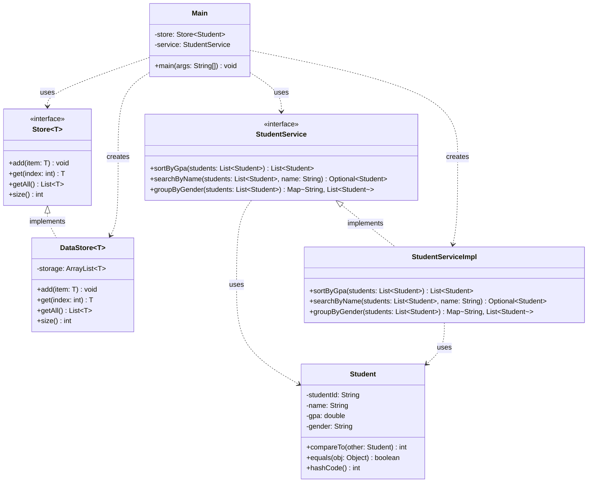
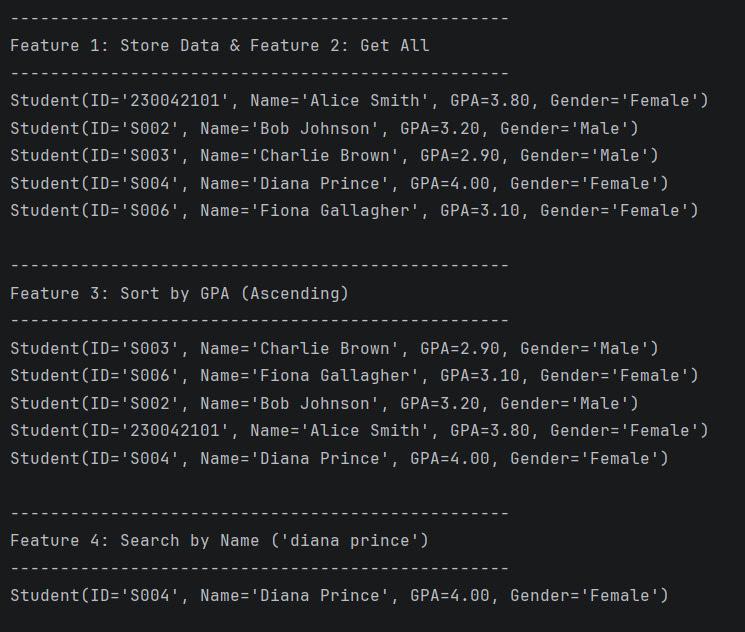
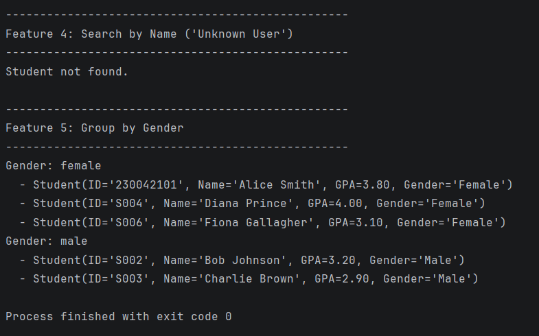

# Student Record Management System (SWE4302)
```text
Name: M Safwan Hasan Khan
Student Id: 230042117
github link : 
```
https://github.com/safwansatil/Object-Oriented-Concepts/tree/main/Lab12_Generics_Collections

---

## Overview

This application manages student records by demonstrating core Java principles. It implements Generics for reusable data storage and utilizes the Collections Framework for data manipulation. The system architecture adheres to SOLID principles by separating concerns into distinct model, store, and service components.

## Project Structure

```text
src/main/java/org/example/
├── model/
│   └── Student.java   // Immutable data model for student records
├── store/
│   ├── Store.java // Generic interface for data storage operations
│   └── DataStore.java // ArrayList-backed implementation of Store
├── service/
│   ├── StudentService.java   // Interface defining operations
│   └── StudentServiceImpl.java   // Implementation
                             // of StudentService using Stream API
└── Main.java        // Entry point demonstrating system features
```

## System Design



Store is defined as an interface to decouple the storage mechanism from the application logic. Student is immutable to prevent unintended side effects when instances are shared across layers. The Main class depends exclusively on the Store and StudentService interfaces to adhere to the Dependency Inversion Principle.

## Core Concepts Explained

### Generic DataStore

The DataStore class provides a type-safe storage mechanism by implementing a generic interface.

```java
    @Override
    public void add(T item) {
        this.storage.add(item);
    }

    @Override
    public List<T> getAll() {
        return new ArrayList<>(this.storage);
    }
```

### Sort by GPA

The service layer sorts the students using the Collection framework based on their natural ordering.

```java
    @Override
    public List<Student> sortByGpa(List<Student> students) {
        List<Student> sortedList = new ArrayList<>(students);
        Collections.sort(sortedList);
        return sortedList;
    }
```

### Search by Name

The service searches for a matching student name while handling potential null values securely using an Optional.

```java
    @Override
    public Optional<Student>
     searchByName(List<Student> students, String name) {
        if (name == null) {
            return Optional.empty();
        }
        return students.stream()
                .filter(student -> student.getName()
                .equalsIgnoreCase(name))
                .findFirst();
    }
```

### Group by Gender

The system categorizes students by their normalized gender strings utilizing the Stream API Collectors.

```java
    @Override
    public Map<String, List<Student>> 
    groupByGender(List<Student> students) {
        return students.stream()
                .collect(Collectors.groupingBy(
                        student -> student.getGender()
                        .trim()
                        .toLowerCase()
                ));
    }
```

## How to Run

1. Open a terminal in the project root directory.
2. Compile the code using `javac -d out src/main/java/org/example/**/*.java src/main/java/org/example/*.java`.
3. Execute the compiled classes using `java -cp out org.example.Main`.

## Sample Output

The console prints the results sequentially, separated by feature headers. It displays all students initially added to the data store, followed by the list sorted by GPA. It then prints the results for both valid and invalid name searches, and ends with the students grouped categorically by gender.



