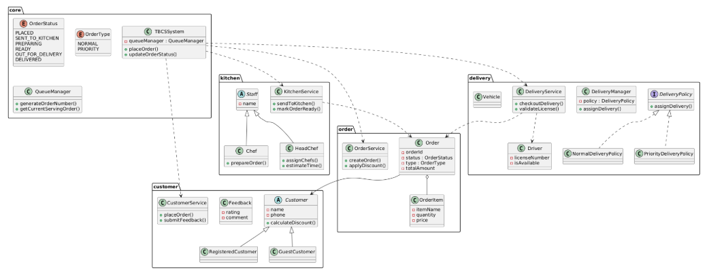
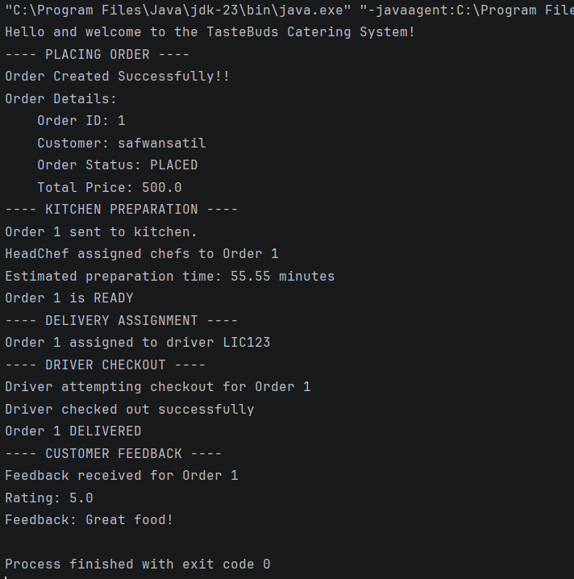

# TasteBuds Catering Service (TBCS)

Quiz 2 Assignment - SWE4302
Student Id: 230042117

## Overview

The problem was solved using a modular structure, following the ooc principles.
This allows on easy extension and maintenance of the codebase, since it follows separation of concerns and uses interfaces and abstract classes to define contracts between different components.
The project can be easily extended, by adding necessary services or models without modifying existing code, since it follows modular structure.
For example, if you want to add Dine-In service, you can create a new service class implementing the necessary interface without changing existing classes.


## Design

The design follows a layered, object-oriented approach. High-level UML:



### Why This Design 

- **Layered responsibilities**: separation between models, services, and core/controller simplifies reasoning and testing.
- **Single Responsibility**: each class has one clear purpose (e.g., `OrderService` handles ordering logic, `DeliveryService` handles assignment and delivery flows).
- **Explicit business rules**: enums capture fixed domain rules (order statuses, delivery types), keeping logic clear and centralized.
- **Clear flow control**: core/controller coordinates overall system flow without embedding business logic.

### Extensibility & Maintainability

- **Easy to add new features**: adding online payment, multiple courier providers, or a new delivery policy is done by adding new service classes or strategy implementations — no rewriting of existing classes.
- **Open/Closed principle**: existing code is open for extension but closed for modification; new behaviors are added via new implementations (e.g., `PaymentService`, `CourierAdapter`).
- **No rewriting for extensions**: integration points (services, delivery policies, and interfaces) allow new features to be plugged in.
- **Readable, testable, maintainable**: small classes, clear interfaces, and layered separation make unit testing straightforward and keep code easy to navigate.

## Project Structure (recommended organization)
```text
src/
├── core/     // allows relation between multiple modules
│ └── QueueManager.java
│
├── kitchen/
│ ├── KitchenService.java
│ └── HeadChef.java
│
├── customer/
│ ├── OrderService.java
│ ├── DeliveryService.java
│  
│── order/
│ └── Order.java
│ └── OrderService.java
│ 
├── delivery/
│ ├── deliveryService.java
│ └── Delivery.java
│ 
```
This repository follows the same breakdown inside `src/main/java/org/example/` where modules group `Core`, `Customer`, `Kitchen`, `Delivery`, and `Order` responsibilities.


### Mapping to Requirements

- **Placing an Order**: `OrderService` creates `Order` objects, assigns queue numbers, applies discounts for registered customers, and notifies kitchen via queue manager.
- **Kitchen Preparation (Head Chef)**: Head Chef component receives the order details and classifies as normal or priority. The chef assigns staff, records estimated time, and updates `OrderStatus`.
- **Delivery Assignment**: `DeliveryService` picks vehicles and drivers based on order category and availability. Priority orders are scheduled within the required time window.
- **Driver Checkout**: Drivers checkout deliveries using their driving license details stored in the system; the driver record and license are validated before checkout.
- **Customer Feedback**: After delivery, customers can rate orders and leave comments; feedback is stored and can be used for analytics or service improvements.


## Demonstration Output 


Example output screenshots:



### Running the Project

- Build with Maven:

```bash
mvn clean package
```

- Run the demo/main class (IDE or):

```bash
mvn exec:java -Dexec.mainClass="org.example.Main"
```

Adjust `mainClass` as needed for the project entry.

### Testing

- Unit tests are present under `src/test/java` and can be executed with:

```bash
mvn test
```

 tests focused on services and business rules (discount calculations, queueing, delivery assignment logic, and driver checkout validation).


